# RealEstateAI

An open-source AI assistant for real estate agents. It talks to your inbound leads on
WhatsApp or Telegram, qualifies them (budget, timeline, area, property type, ownership),
scores each lead 0 to 100, books viewings into your calendar, and hands the hot ones to
you with a transcript.

You host it. You bring your own AI key. Nothing in this repo bills you, and there is no
paid plan, license key, or hosted service behind it.

Configured out of the box for the Dubai and UAE market: AED, RERA compliance guardrails,
freehold and off-plan vocabulary, Friday and Saturday weekend, and prayer-time awareness.

## Screenshots

| Lead conversation, qualified and scored | Leads pipeline |
| --- | --- |
| 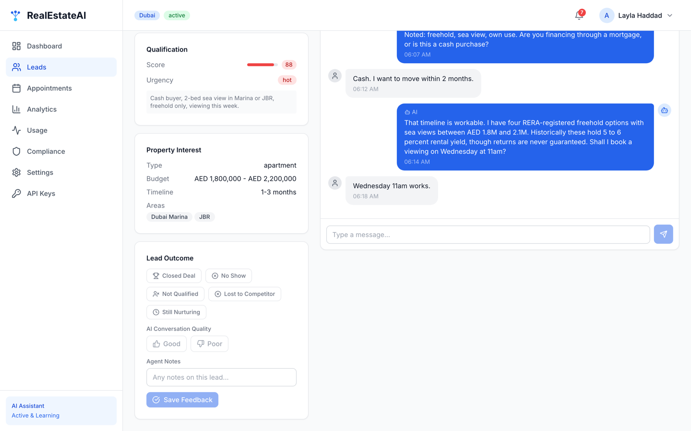 | 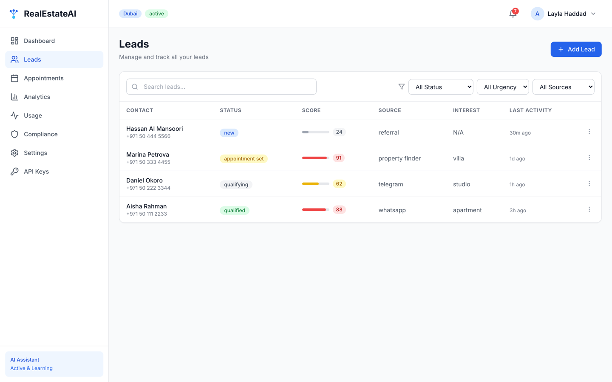 |

| Dashboard | API keys, bring your own |
| --- | --- |
| 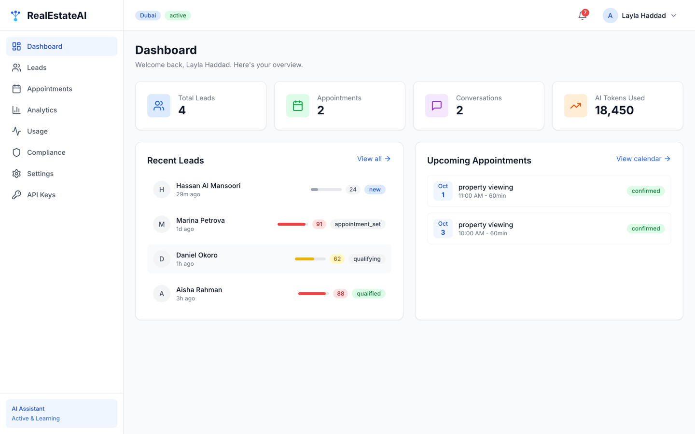 | 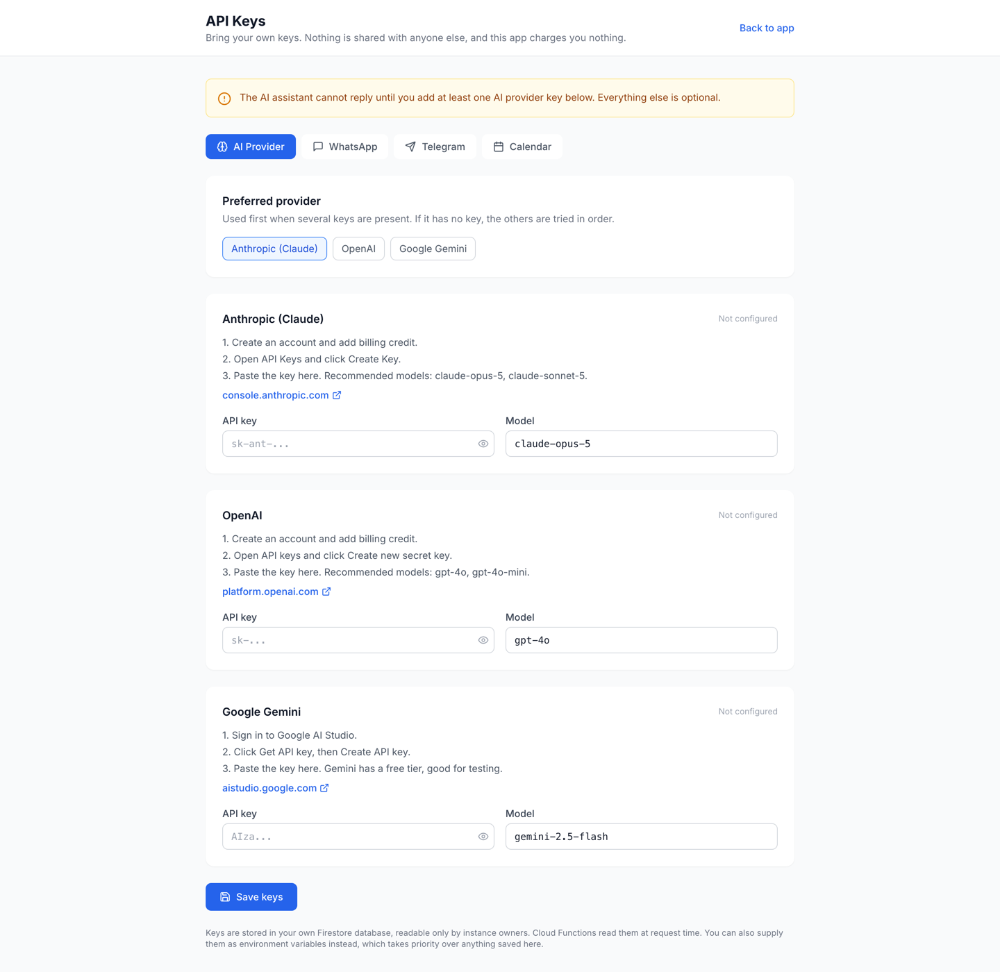 |

| Appointments | Landing page |
| --- | --- |
| 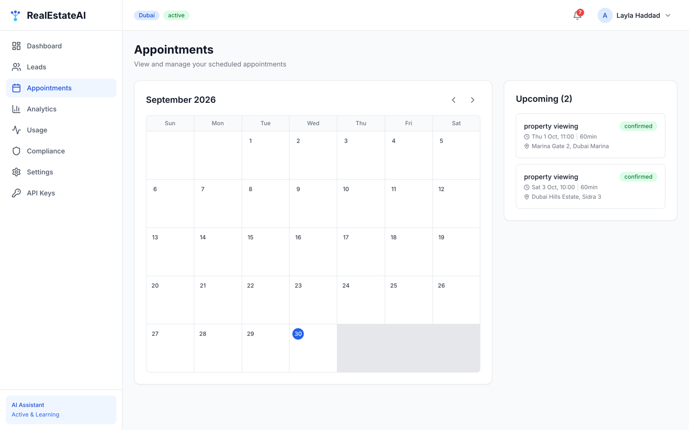 | 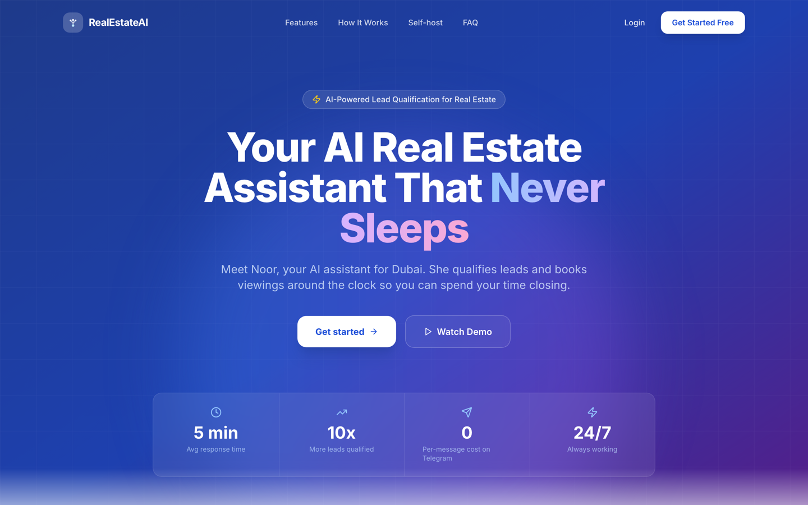 |

<details>
<summary>More: onboarding, analytics, usage, settings, compliance</summary>

| | |
| --- | --- |
| 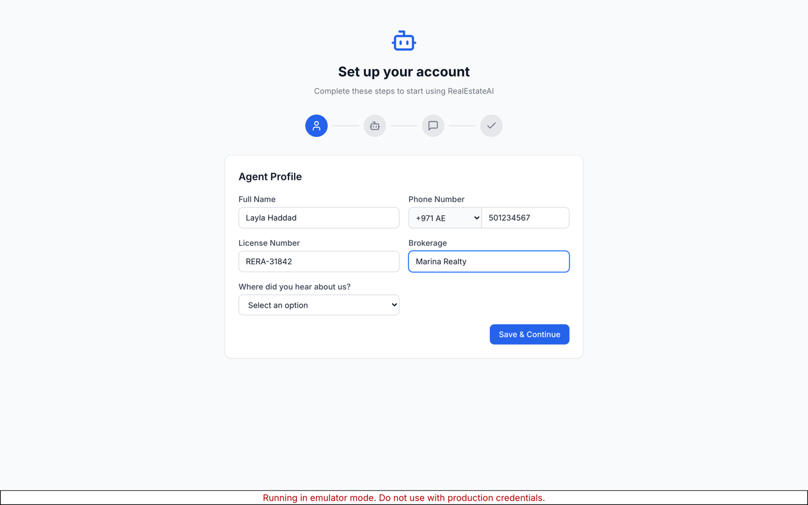 | 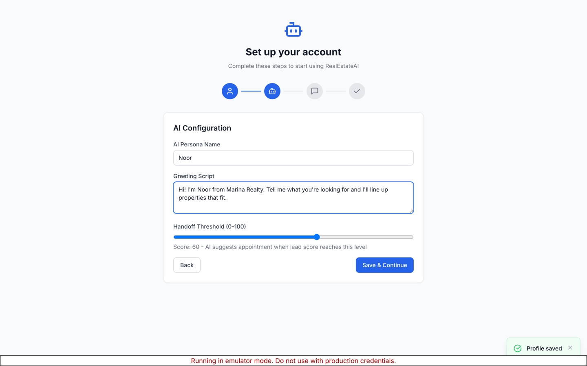 |
| 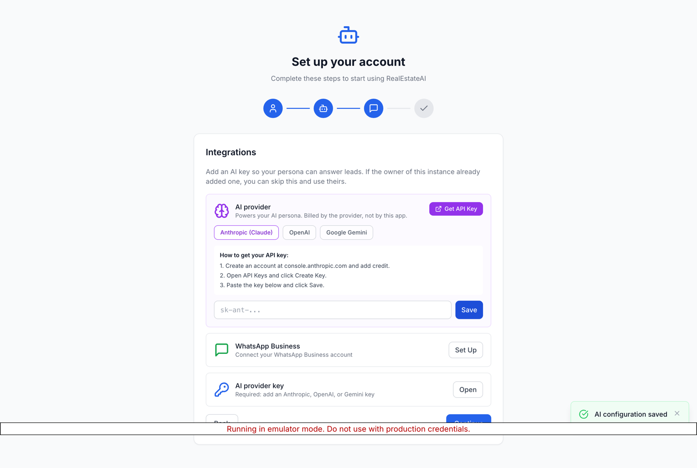 | 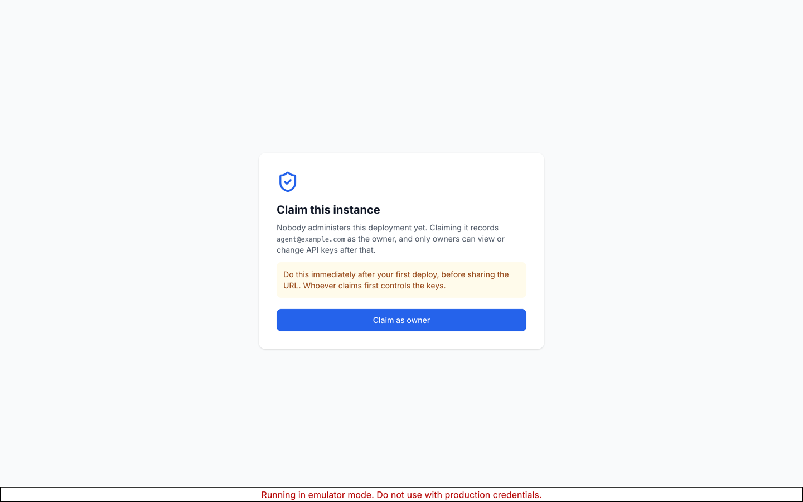 |
| 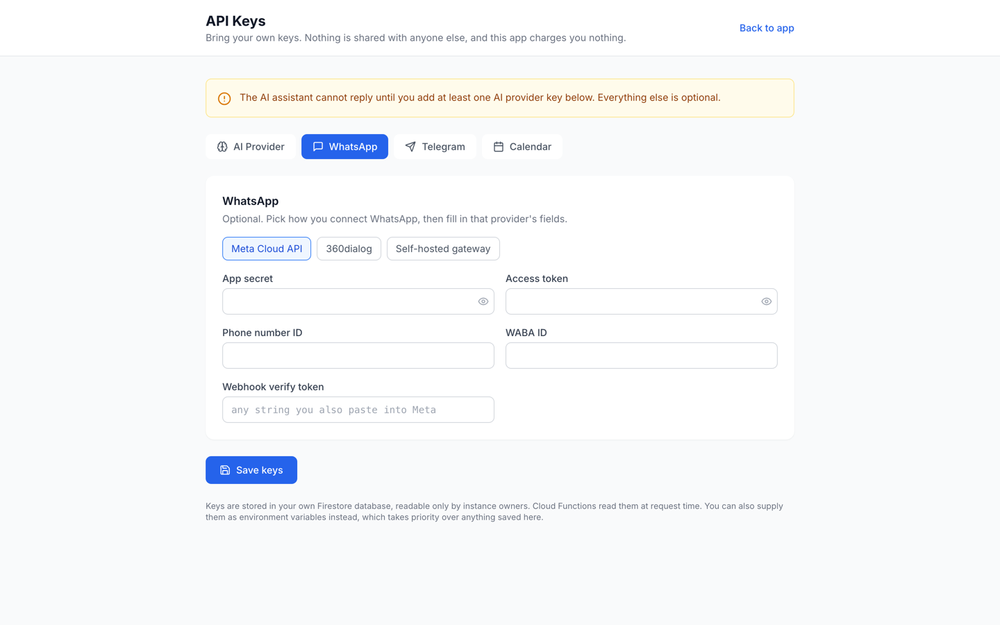 | 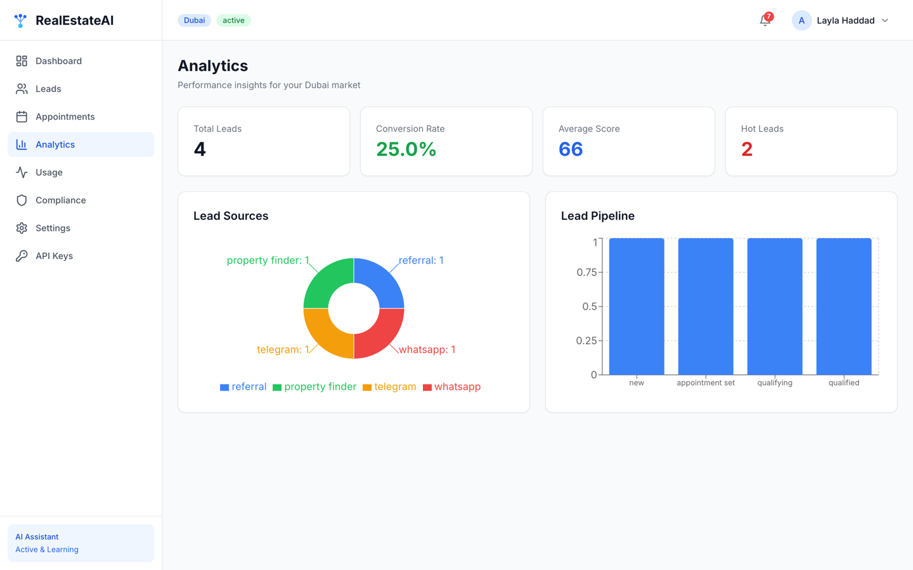 |
| 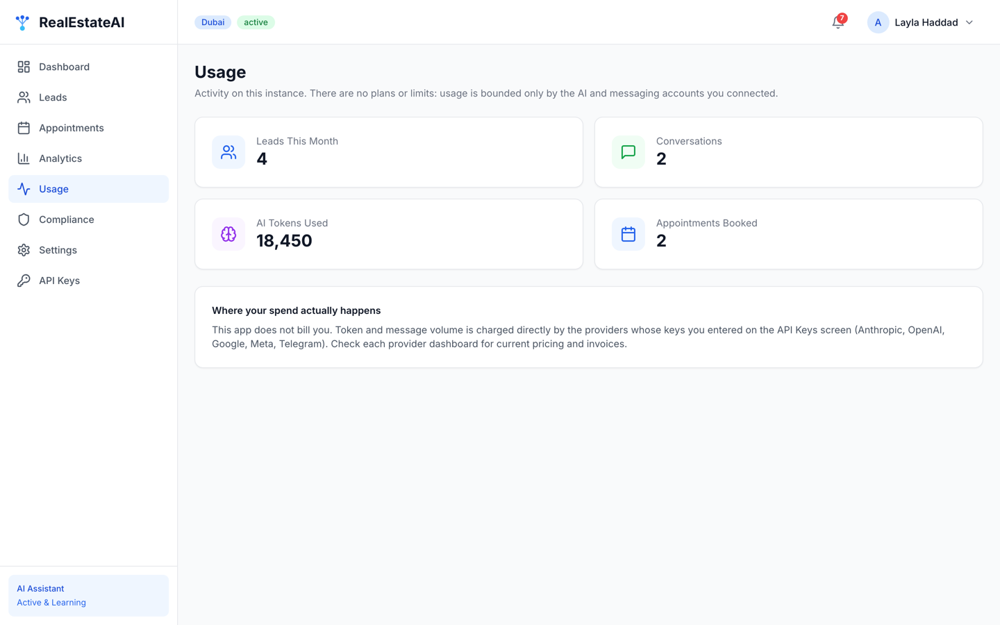 | 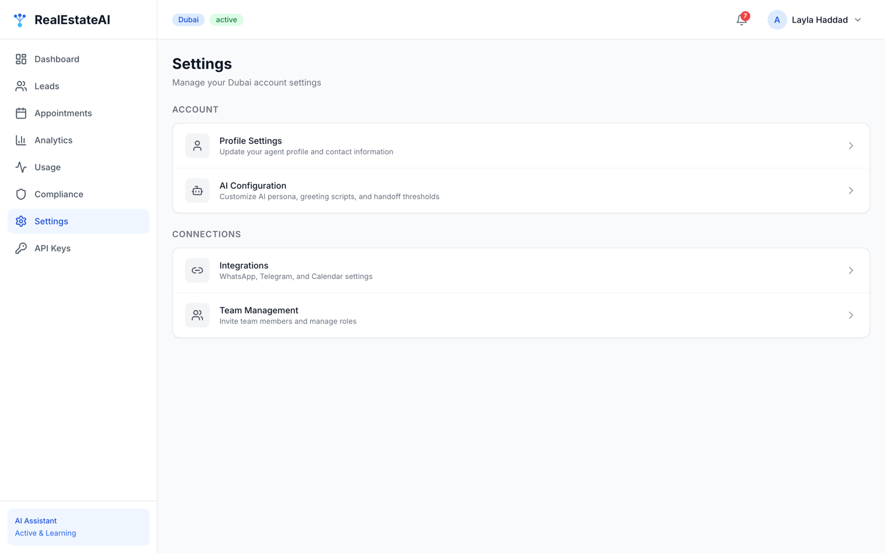 |
| 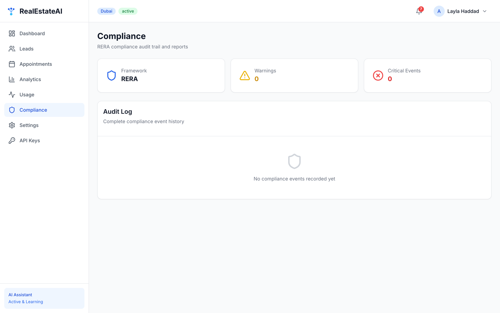 | 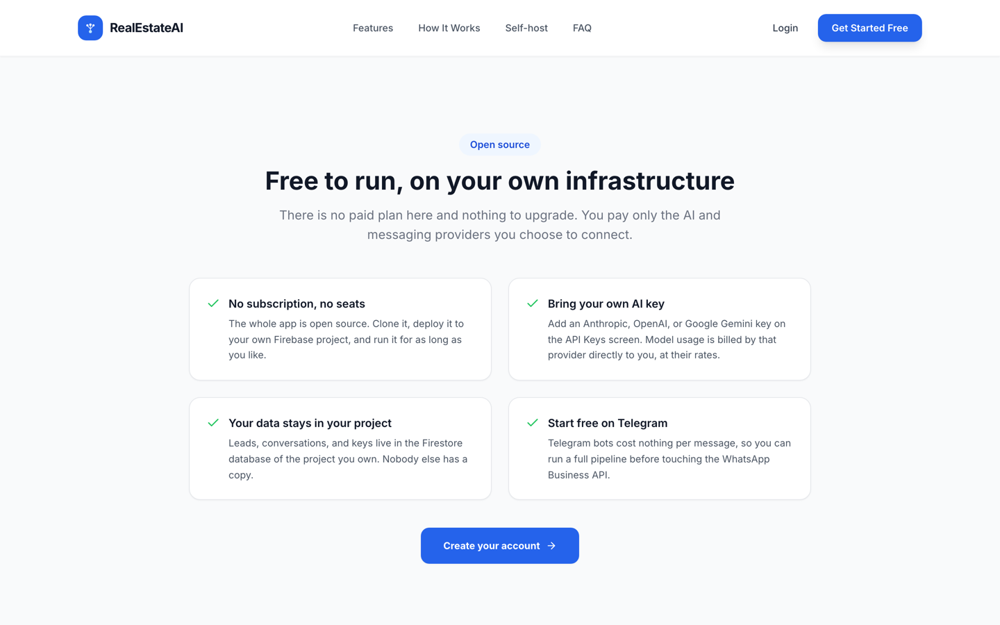 |

</details>

Screenshots show the app running against the Firebase emulators with the demo data from
`tools/seed-demo.mjs`.

## How it works

```
Lead messages your WhatsApp or Telegram number
        |
        v
Cloud Function webhook  (verifies signature, finds or creates the lead)
        |
        v
AI service  ->  your AI provider (Anthropic, OpenAI, or Google Gemini)
        |          system prompt carries market rules + RERA constraints
        v
Compliance check  (blocks guaranteed-return claims and other RERA risks,
        |          regenerates the reply if needed)
        v
Reply sent back on the same channel, stored in Firestore
        |
        v
Lead scored 0-100.  Score past your threshold -> flagged for handoff,
                    and the AI offers a viewing slot
        |
        v
Calendar Manager  ->  Google Calendar or Outlook, plus an .ics invite
```

Everything lives in one Firebase project:

| Piece | What it does |
| --- | --- |
| `src/` | React + Vite dashboard: leads, conversations, calendar, analytics, compliance log, settings, API keys |
| `functions/` | Cloud Functions: channel webhooks, AI orchestration, lead ingestion, calendar sync, compliance logging |
| `firestore.rules` | Access control. Each agent (tenant) can read only their own data; API keys are readable only by the instance owner |
| `whatsapp-gateway/` | Optional self-hosted WhatsApp bridge (Baileys), for when you do not want the official Business API |

Key design points:

- **Multi-tenant by account.** Each signed-in agent gets a tenant document keyed by their
  uid, with their own leads, conversations, appointments, and AI persona.
- **Bring-your-own-key, two levels.** The instance owner sets keys on the API Keys screen
  for everyone; an individual agent can override with their own key in Settings, which
  then bills to their account.
- **Provider-agnostic AI.** One adapter covers Anthropic, OpenAI, and Gemini. Switch
  provider or model without touching code.
- **Compliance is code, not a promise.** `functions/src/utils/compliance.ts` checks every
  outbound AI message against blocked phrases and RERA rules before it is sent, and logs
  every flag to an append-only audit collection.

## What it costs to run

The app is free. Your bills come from the providers you connect:

| Provider | What you pay | Notes |
| --- | --- | --- |
| AI provider | Per token, at their rates | Gemini has a free tier, good for trying it out |
| Firebase | Free Spark tier covers light use | Cloud Functions need the pay-as-you-go Blaze plan; low traffic usually stays near zero |
| Telegram | Nothing | No per-message cost |
| WhatsApp Business API | Per conversation | Optional. Skip it and use Telegram, or use the included self-hosted gateway |
| Calendar sync | Nothing | Google and Microsoft OAuth are free |

## Setup

### 1. Prerequisites

- Node.js 20
- A Google account
- `npm install -g firebase-tools`
- Java 21 or later, only if you want to run the local emulators

### 2. Create your Firebase project

1. Open [console.firebase.google.com](https://console.firebase.google.com) and create a project.
2. **Authentication** -> Get started -> enable **Email/Password**.
3. **Firestore Database** -> Create database -> production mode.
4. **Project settings** -> General -> Your apps -> add a **Web app**, and copy the config values.
5. Upgrade the project to the **Blaze** plan (required for Cloud Functions). Set a budget
   alert while you are there.

### 3. Configure and install

```bash
git clone https://github.com/josephhamawi/realestateai.git
cd realestateai

cp .env.local.example .env.local      # paste your Firebase web config here
cp .firebaserc.example .firebaserc    # put your project id here
cp functions/.env.example functions/.env.local   # optional: keys as env vars

npm install
npm install --prefix functions
```

### 4. Deploy

```bash
firebase use --add            # select your project
firebase deploy --only firestore:rules,firestore:indexes
npm run build
firebase deploy --only hosting,functions
```

### 5. Claim the instance and add your AI key

1. Open your deployed URL and create an account.
2. Go to **/setup** (the **API Keys** item in the sidebar) and click **Claim as owner**.
   Do this immediately, before sharing the URL: the first account to claim it controls
   the keys.
3. Add an API key for at least one AI provider:

   | Provider | Where to get a key |
   | --- | --- |
   | Anthropic (Claude) | [console.anthropic.com](https://console.anthropic.com/settings/keys) |
   | OpenAI | [platform.openai.com](https://platform.openai.com/api-keys) |
   | Google Gemini | [aistudio.google.com](https://aistudio.google.com/app/apikey) |

4. Optionally add Telegram, WhatsApp, and calendar credentials on the same screen.

The assistant will not reply until at least one AI key is present. Everything else is
optional.

### 6. Connect a channel

**Telegram (easiest, free):** message [@BotFather](https://t.me/botfather), send
`/newbot`, paste the token into the Telegram tab on the API Keys screen, then call the
`registerTelegramWebhook` function once from your app to point Telegram at your webhook.

**WhatsApp:** either use the official Business API (Meta or 360dialog credentials go in the
WhatsApp tab), or run `whatsapp-gateway/` on a small VPS and point the gateway fields at it.
See `whatsapp-gateway/README.md`.

## Local development

```bash
# terminal 1: emulators (needs Java 21+)
npm run emulators

# terminal 2: dev server, with VITE_USE_EMULATORS=true in .env.local
npm run dev
```

Optional demo data, so the dashboard is not empty while you look around:

```bash
node tools/seed-demo.mjs        # against the emulators
```

## Configuration reference

Every value can come from an environment variable or from the API Keys screen. Environment
variables win.

**Frontend (`.env.local`)** — see `.env.local.example`. Firebase web config plus optional
branding: `VITE_APP_NAME`, `VITE_OPERATOR_NAME`, `VITE_CONTACT_EMAIL`, `VITE_PUBLIC_URL`,
`VITE_REPO_URL`.

**Functions (`functions/.env.local` or the deployed environment)** — see
`functions/.env.example`:

| Variable | Purpose |
| --- | --- |
| `AI_PROVIDER` | `anthropic`, `openai`, or `gemini`. Which provider to try first |
| `ANTHROPIC_API_KEY` / `ANTHROPIC_MODEL` | Claude credentials, default model `claude-opus-5` |
| `OPENAI_API_KEY` / `OPENAI_MODEL` | OpenAI credentials, default model `gpt-4o` |
| `GEMINI_API_KEY` / `GEMINI_MODEL` | Gemini credentials, default model `gemini-2.5-flash` |
| `APP_BASE_URL` | Public URL of your app, used for OAuth redirects |
| `FUNCTIONS_BASE_URL`, `FUNCTIONS_REGION` | Only if you use a custom domain or non-default region |
| `WHATSAPP_*`, `D360_API_KEY`, `BAILEYS_*` | WhatsApp, depending on provider |
| `TELEGRAM_BOT_TOKEN` | Telegram bot |
| `GOOGLE_CLIENT_ID` / `GOOGLE_CLIENT_SECRET` | Google Calendar OAuth |
| `MS_CLIENT_ID` / `MS_CLIENT_SECRET` | Outlook Calendar OAuth |

## Security notes

- Deploy `firestore.rules` before you use the app. Without them, Firestore in production
  mode denies everything and the app appears broken; in test mode it would be wide open.
- The first account to visit `/setup` claims the instance. Claim it yourself right after
  deploying.
- API keys are stored in your own Firestore, readable only by instance owners, and are
  sent only to the provider they belong to.
- `.env.local` and `.firebaserc` are gitignored. Keep them that way.
- The legal pages (`/terms`, `/privacy`) are templates written for a Dubai deployment and
  say so in a banner at the top of each. They describe only what the code actually does:
  TLS in transit, Google-managed encryption at rest, tenant isolation enforced by
  `firestore.rules`, and no third-party security certification. Set `VITE_OPERATOR_NAME`
  and `VITE_CONTACT_EMAIL`, adjust the retention and rights sections to your practice,
  remove the banner, and have your own counsel review the result. They are a starting
  point, not legal advice.

## Adapting to another market

Dubai specifics are concentrated in a few places, so a Lagos or London variant is mostly
prompt and config work:

- `functions/src/services/ai.ts` — the market block of the system prompt
- `functions/src/utils/compliance.ts` — regulator rules and blocked phrases
- `src/lib/marketConfig.ts` — currency, areas, property types, weekend
- `market_config/dubai` in Firestore — runtime overrides, seeded on first signup

## License

MIT. See [LICENSE](LICENSE).
